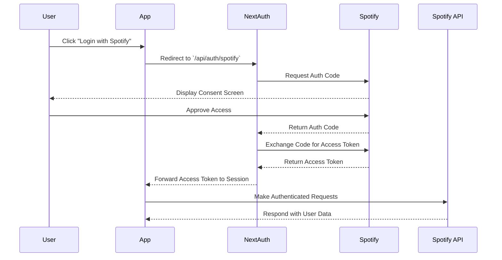

<div align="center">
  
# 🎵 Spotify Profile Viewer

[](https://nextjs.org/)
[](https://www.typescriptlang.org/)
[](https://tailwindcss.com/)
[](https://opensource.org/licenses/MIT)
[](http://makeapullrequest.com)

[Live Demo](https://port3-ten.vercel.app/) | [Report Bug](https://github.com/BradleyMatera/Port3/issues) | [Request Feature](https://github.com/BradleyMatera/Port3/issues)


A modern, full-stack application that brings your Spotify profile to life with stunning visualizations and seamless authentication.

</div>

## ✨ Features

<table>
  <tr>
    <td>
      
      <h3>Home Page</h3>
      <p>A modern, welcoming home page to get started with your Spotify journey.</p>
    </td>
    <td>
      
      <h3>Profile View</h3>
      <p>Access detailed insights into your Spotify profile and listening habits.</p>
    </td>
    <td>
      
      <h3>Music Search</h3>
      <p>Discover new tracks and artists with a powerful search feature.</p>
    </td>
  </tr>
  <tr>
    <td>
      
      <h3>Web Player</h3>
      <p>Play your favorite songs directly from the web player integration.</p>
    </td>
    <td>
      
      <h3>Audiobooks</h3>
      <p>Explore and enjoy Spotify’s audiobook collection effortlessly.</p>
    </td>
    <td>
      
      <h3>Audiobooks Search</h3>
      <p>Search for audiobooks quickly and efficiently.</p>
    </td>
  </tr>
</table>

## Prerequisites

<details>
<summary>Click to expand</summary>


	•	Node.js 16+ (Download)
	•	npm 7+ (comes bundled with Node.js)
	•	MongoDB Community Edition (Install)
	•	Spotify Developer Account (Dashboard)

</details>


Installation

1️⃣ Clone the repository:

git clone https://github.com/BradleyMatera/Port3.git
cd Port3

2️⃣ Install dependencies:

npm install

3️⃣ Configure environment variables:
Create a .env file in the root directory and add the following:

SPOTIFY_CLIENT_ID=your_client_id
SPOTIFY_CLIENT_SECRET=your_client_secret
SPOTIFY_REDIRECT_URI=http://localhost:3000/api/auth/callback
NEXTAUTH_URL=http://localhost:3000
NEXTAUTH_SECRET=your_secret_key
PORT=3001
MONGODB_URI=mongodb://localhost:27017/spotify-profile

4️⃣ Start development servers:

# Frontend and backend (from project root)
npm run dev

🛠️ Tech Stack

<details>
<summary><b>Frontend</b></summary>


	•	Framework: Next.js 15
	•	UI Components:
	•	TailwindCSS
	•	Radix UI
	•	shadcn/ui
	•	Lucide React icons
	•	State & Forms: React Hook Form + Zod for schema validation
	•	Data Visualization: Recharts
	•	Theme Management: Next-themes
	•	Utilities: date-fns, Embla Carousel

</details>


<details>
<summary><b>Backend</b></summary>


	•	Runtime: Node.js with Express
	•	Database: MongoDB using Mongoose
	•	Authentication: NextAuth.js (Spotify Provider)
	•	Networking: Axios for HTTP requests
	•	Logging: Morgan for request logging

</details>


## 📦 Project Structure

```
spotify-profile-viewer/
Port3/
├── app/                    # Next.js application
│   ├── api/               # API routes (NextAuth + custom endpoints)
│   ├── profile/          # Profile-related pages and logic
│   ├── music-search/     # Music search functionality
│   ├── audio-books/      # Audiobooks search functionality
│   └── login/            # Authentication pages
├── components/            # Shared React components
├── server/               # Express backend (optional)
├── styles/               # Global TailwindCSS styles
├── public/               # Static assets
└── utils/                # Utility functions and helpers
```

## 🎯 Core Features

### 🔐 Authentication Flow


## Spotify Authentication Flow Documentation

Process Overview
	1.	User Initiates Login
	•	The user clicks the “Login with Spotify” button on the app’s interface. This action triggers the authentication process via NextAuth.
	2.	NextAuth Sends Authentication Request
	•	The app utilizes NextAuth’s /api/auth/signin/spotify endpoint, which handles OAuth logic with Spotify.
	3.	API Communicates with Spotify
	•	NextAuth sends an authorization request to Spotify’s OAuth URL. This request includes:
	•	Client ID (from the environment variables or .env file)
	•	Redirect URI (configured in the Spotify Developer Dashboard)
	•	Scopes (e.g., user-read-email, user-read-private, user-top-read)
	•	A randomly generated state to protect against CSRF attacks.
	4.	Spotify Prompts the User
	•	Spotify displays an authorization screen asking the user to approve access to their data.
	5.	User Approves Access
	•	The user grants the requested permissions by approving Spotify’s access prompt.
	6.	Spotify Sends an Authorization Code
	•	Spotify redirects the user back to the callback URL configured in NextAuth, appending an authorization code.
	7.	NextAuth Exchanges Code for Token
	•	NextAuth sends the authorization code to Spotify’s token endpoint to retrieve:
	•	An access token (for authenticated API requests)
	•	A refresh token (to renew access when the token expires)
	•	The token’s expiration time.
	8.	Access Token is Stored in the Session
	•	NextAuth securely stores the access token within the user session, enabling persistent authentication for the app.
	9.	Authenticated API Requests
	•	The app uses the access token from the session to query Spotify’s API for:
	•	User profile data
	•	Playlists
	•	Top tracks and artists
	10.	Automatic Token Refresh
	•	NextAuth automatically refreshes the access token using the refresh token, ensuring a seamless user experience without interruptions.

🔄 API Integration

<details>
<summary>Available Endpoints</summary>


Endpoint	Method	Description
/api/auth/signin	POST	Initiates the NextAuth Spotify login
/api/auth/session	GET	Fetches the active user session
/api/auth/signout	POST	Ends the user session
/api/auth/callback/spotify	GET	Handles Spotify OAuth callbacks

</details>


🎵 Music Discovery Features
	•	Top Tracks and Artists: Displays user’s top tracks and favorite artists.
	•	Dynamic Search: Search and explore music, albums, and playlists via Spotify’s API.
	•	Audiobook Integration: Discover and search Spotify’s audiobook catalog.

This flow is securely managed using NextAuth as the primary authentication solution, minimizing boilerplate and enhancing the app’s maintainability.•	The user clicks the “Login with Spotify” button on the app’s interface. This action triggers the authentication process via NextAuth.

	2.	NextAuth Sends Authentication Request
	•	The app utilizes NextAuth’s /api/auth/signin/spotify endpoint, which handles OAuth logic with Spotify.

	3.	API Communicates with Spotify
	•	NextAuth sends an authorization request to Spotify’s OAuth URL. This request includes:
	•	Client ID (from the environment variables or .env file)
	•	Redirect URI (configured in the Spotify Developer Dashboard)
	•	Scopes (e.g., user-read-email, user-read-private, user-top-read)
	•	A randomly generated state to protect against CSRF attacks.

	4.	Spotify Prompts the User
	•	Spotify displays an authorization screen asking the user to approve access to their data.

	5.	User Approves Access
	•	The user grants the requested permissions by approving Spotify’s access prompt.

	6.	Spotify Sends an Authorization Code
	•	Spotify redirects the user back to the callback URL configured in NextAuth, appending an authorization code.

	7.	NextAuth Exchanges Code for Token
	•	NextAuth sends the authorization code to Spotify’s token endpoint to retrieve:
	•	An access token (for authenticated API requests)
	•	A refresh token (to renew access when the token expires)
	•	The token’s expiration time.

	8.	Access Token is Stored in the Session
	•	NextAuth securely stores the access token within the user session, enabling persistent authentication for the app.

	9.	Authenticated API Requests
	•	The app uses the access token from the session to query Spotify’s API for:
	•	User profile data
	•	Playlists
	•	Top tracks and artists
  
	10.	Automatic Token Refresh
	•	NextAuth automatically refreshes the access token using the refresh token, ensuring a seamless user experience without interruptions.

🔄 API Integration

<details>
<summary>Available Endpoints</summary>


Endpoint	Method	Description
/api/auth/signin	POST	Initiates the NextAuth Spotify login
/api/auth/session	GET	Fetches the active user session
/api/auth/signout	POST	Ends the user session
/api/auth/callback/spotify	GET	Handles Spotify OAuth callbacks

</details>


🎵 Music Discovery Features
	•	Top Tracks and Artists: Displays user’s top tracks and favorite artists.
	•	Dynamic Search: Search and explore music, albums, and playlists via Spotify’s API.
	•	Audiobook Integration: Discover and search Spotify’s audiobook catalog.

This flow is securely managed using NextAuth as the primary authentication solution, minimizing boilerplate and enhancing the app’s maintainability.

</div>

## 🚀 Deployment

### Vercel Deployment

[](https://vercel.com/new/git/external?repository-url=https://github.com/username/spotify-profile-viewer)

1. Click the "Deploy" button
2. Connect your GitHub repository
3. Configure environment variables
4. Deploy!

## 🤝 Contributing

We love your input! Check out our [Contributing Guide](CONTRIBUTING.md) to get started.

<details>
<summary>Development Process</summary>

1. Fork the Project
2. Create your Feature Branch (`git checkout -b feature/AmazingFeature`)
3. Commit your Changes (`git commit -m 'Add some AmazingFeature'`)
4. Push to the Branch (`git push origin feature/AmazingFeature`)
5. Open a Pull Request

</details>

## 📈 Project Roadmap

- [x] Basic authentication
- [x] Profile viewing
- [ ] Top tracks/artists
- [ ] Playlist management
- [ ] Social features
- [ ] Advanced analytics

## 🙋 FAQ

<details>
<summary><b>How do I get Spotify API credentials?</b></summary>
1. Go to Spotify Developer Dashboard
2. Create a new application
3. Copy Client ID and Secret
4. Configure redirect URI
</details>

<details>
<summary><b>Can I use this with my free Spotify account?</b></summary>
Yes! The app works with both Free and Premium Spotify accounts, though some features may be limited with Free accounts.
</details>

## 📄 License

This project is licensed under the MIT License - see the [LICENSE](LICENSE) file for details.

## 🙏 Acknowledgments

- [Spotify Web API](https://developer.spotify.com/documentation/web-api/)
- [Next.js Team](https://nextjs.org/)
- [Tailwind CSS](https://tailwindcss.com/)
- [shadcn/ui](https://ui.shadcn.com/)

---

<div align="center">

Made with ❤️ by [Bradely Matera](https://github.com/BradleyMatera)

⭐️ Star us on GitHub — it helps!

</div>