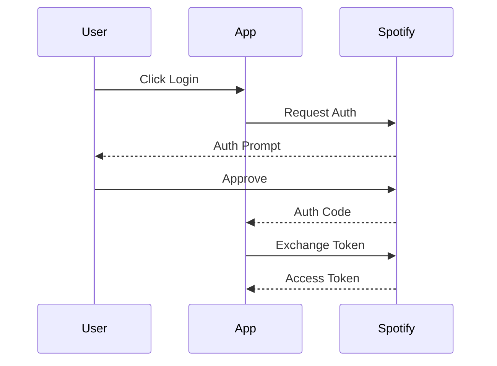

<div align="center">
  
# 🎵 Spotify Profile Viewer

[](https://nextjs.org/)
[](https://www.typescriptlang.org/)
[](https://tailwindcss.com/)
[](https://opensource.org/licenses/MIT)
[](http://makeapullrequest.com)

[Live Demo](https://spotify-profile-viewer.vercel.app) | [Report Bug](https://github.com/username/spotify-profile-viewer/issues) | [Request Feature](https://github.com/username/spotify-profile-viewer/issues)


A modern, full-stack application that brings your Spotify profile to life with stunning visualizations and seamless authentication.

</div>

## ✨ Features

<table>
  <tr>
    <td>
      
      <h3>Secure Authentication</h3>
      <p>Seamless OAuth2 flow with automatic token refresh</p>
    </td>
    <td>
      
      <h3>Rich Profile Data</h3>
      <p>Comprehensive view of your Spotify profile</p>
    </td>
    <td>
      
      <h3>Visual Analytics</h3>
      <p>Beautiful charts for your listening habits</p>
    </td>
  </tr>
</table>

## 🚀 Quick Start

### Prerequisites

<details>
<summary>Click to expand</summary>

- Node.js 16+ ([Download](https://nodejs.org/))
- npm 7+
- MongoDB ([Install](https://www.mongodb.com/try/download/community))
- Spotify Developer Account ([Dashboard](https://developer.spotify.com/dashboard/))

</details>

### Installation

1️⃣ Clone the repository
```bash
git clone https://github.com/your-username/spotify-profile-viewer.git
cd spotify-profile-viewer
```

2️⃣ Install dependencies
```bash
npm install
```

3️⃣ Configure environment variables
```env
SPOTIFY_CLIENT_ID=your_client_id
SPOTIFY_CLIENT_SECRET=your_client_secret
SPOTIFY_REDIRECT_URI=http://localhost:3001/auth/callback
```

4️⃣ Start development servers
```bash
# Backend
cd server && node server.js

# Frontend (new terminal)
npm run dev
```

## 🛠️ Tech Stack

<details>
<summary><b>Frontend</b></summary>

- **Framework:** Next.js 15 with TypeScript 5
- **UI Components:** 
  - Radix UI primitives
  - shadcn/ui components
  - Tailwind CSS
  - Lucide React icons
- **State & Forms:** React Hook Form + Zod
- **Data Visualization:** Recharts
- **Theme:** Next-themes
- **Utils:** date-fns, Embla Carousel

</details>

<details>
<summary><b>Backend</b></summary>

- **Runtime:** Node.js with Express
- **Database:** MongoDB + Mongoose
- **Auth:** Custom OAuth implementation
- **Networking:** Axios
- **Logging:** Morgan

</details>

## 📦 Project Structure

```
spotify-profile-viewer/
├── app/                    # Next.js application
│   ├── api/               # API routes
│   ├── profile/          # Profile pages
│   └── login/            # Authentication
├── components/            # React components
├── server/               # Backend server
└── public/               # Static assets
```

## 🎯 Core Features

### 🔐 Authentication Flow


### 📊 Data Visualization


### 🎵 Music Discovery
- Top artists and tracks
- Personalized recommendations
- Playlist generation

## 🔄 API Integration

<details>
<summary>Available Endpoints</summary>

| Endpoint | Method | Description |
|----------|---------|-------------|
| `/api/auth/spotify` | GET | Initiate Spotify OAuth |
| `/api/auth/callback` | GET | OAuth callback handler |
| `/api/profile` | GET | Get user profile |
| `/api/top-tracks` | GET | Get user's top tracks |

</details>

## 📱 Responsive Design

<div align="center">
  
  
</div>

## 🚀 Deployment

### Vercel Deployment

[](https://vercel.com/new/git/external?repository-url=https://github.com/username/spotify-profile-viewer)

1. Click the "Deploy" button
2. Connect your GitHub repository
3. Configure environment variables
4. Deploy!

## 🤝 Contributing

We love your input! Check out our [Contributing Guide](CONTRIBUTING.md) to get started.

<details>
<summary>Development Process</summary>

1. Fork the Project
2. Create your Feature Branch (`git checkout -b feature/AmazingFeature`)
3. Commit your Changes (`git commit -m 'Add some AmazingFeature'`)
4. Push to the Branch (`git push origin feature/AmazingFeature`)
5. Open a Pull Request

</details>

## 📈 Project Roadmap

- [x] Basic authentication
- [x] Profile viewing
- [x] Top tracks/artists
- [ ] Playlist management
- [ ] Social features
- [ ] Advanced analytics

## 🙋 FAQ

<details>
<summary><b>How do I get Spotify API credentials?</b></summary>
1. Go to Spotify Developer Dashboard
2. Create a new application
3. Copy Client ID and Secret
4. Configure redirect URI
</details>

<details>
<summary><b>Can I use this with my free Spotify account?</b></summary>
Yes! The app works with both Free and Premium Spotify accounts, though some features may be limited with Free accounts.
</details>

## 📄 License

This project is licensed under the MIT License - see the [LICENSE](LICENSE) file for details.

## 🙏 Acknowledgments

- [Spotify Web API](https://developer.spotify.com/documentation/web-api/)
- [Next.js Team](https://nextjs.org/)
- [Tailwind CSS](https://tailwindcss.com/)
- [shadcn/ui](https://ui.shadcn.com/)

---

<div align="center">

Made with ❤️ by [Bradely Matera](https://github.com/BradleyMatera)

⭐️ Star us on GitHub — it helps!

</div>