```mermaid
graph TD
A[Project Root] --> B[./app]
A --> C[./components]
A --> D[./hooks]
A --> E[./lib]
A --> F[./server]
A --> G[./utils]
A --> H[./styles]
A --> I[./public]
A --> J[./Designs]
A --> K[./config]
A --> L[Other Root Files]

%% App folder
B --> B1[./app/api/auth/callback/route.ts]
B1 --> B1A["import { NextResponse } from 'next/server';"]
B1 --> B1B["import { generateRandomString } from '../../../../utils';"]

B --> B2[./app/api/auth/spotify/route.ts]
B2 --> B2A["import { NextResponse } from 'next/server';"]
B2 --> B2B["import { cookies } from 'next/headers';"]

B --> B3[./app/layout.tsx]
B3 --> B3A["import './globals.css';"]
B3 --> B3B["import { BottomNav } from '@/components/layout/bottom-nav';"]

B --> B4[./app/music-search/page.tsx]
B4 --> B4A["import { useState, useEffect } from 'react';"]
B4 --> B4B["import { Button } from '@/components/ui/button';"]

B --> B5[./app/profile/profile-client.tsx]
B5 --> B5A["import { ChevronRight } from 'lucide-react';"]
B5 --> B5B["import Image from 'next/image';"]

%% Components folder
C --> C1[./components/ui/button.tsx]
C1 --> C1A["import { FC, ButtonHTMLAttributes } from 'react';"]

C --> C2[./components/layout/bottom-nav.tsx]
C2 --> C2A["import Link from 'next/link';"]
C2 --> C2B["import { useRouter } from 'next/navigation';"]

%% Hooks folder
D --> D1[./hooks/useSpotifyAuth.ts]
D1 --> D1A["import { useEffect, useState } from 'react';"]

D --> D2[./hooks/use-toast.ts]
D2 --> D2A["import { useToast } from 'some-toast-library';"]

%% Lib folder
E --> E1[./lib/utils.ts]
E1 --> E1A["export async function fetchData(url: string) {...};"]

%% Server folder
F --> F1[./server/controllers/authentication_controller.js]
F1 --> F1A["import { generateToken } from '../utils/token';"]

F --> F2[./server/routes/auth.js]
F2 --> F2A["import { Router } from 'express';"]
F2 --> F2B["import { login, logout } from '../controllers/authentication_controller';"]

%% Utils folder
G --> G1[./utils/index.ts]
G1 --> G1A["export function generateRandomString(length: number): string {...};"]

%% Styles folder
H --> H1[./styles/globals.css]

%% Public folder
I --> I1[./public/placeholder.jpg]
I --> I2[./public/spotify-logo.svg]

%% Config files
L --> L1[./next.config.mjs]
L1 --> L1A["module.exports = {...};"]

L --> L2[./tailwind.config.ts]
L2 --> L2A["module.exports = {...};"]

%% README and Designs
L --> M1[./README.md]
J --> J1[./Designs/Home.png]
```

# Project Structure Documentation

## File Organization Overview

1. **Main Files in the Project**
   * The top-level node represents all the primary files and directories in your project, like app, components, server, and lib. Each file is shown as a node, with arrows pointing to other files it depends on.

2. **App Directory**
   * This is the main entry point for your Next.js application. For instance:
   * app/music-search/page.tsx depends on React imports like useState and useEffect, and components like Button from the UI folder.
   * app/profile/profile-client.tsx uses external libraries like lucide-react and next/image to render user data.

3. **Component Dependencies**
   * Components like bottom-nav.tsx are imported across multiple files (e.g., in app/profile/page.tsx and app/layout.tsx). This shows shared UI elements, such as the bottom navigation bar, being reused throughout the project.

4. **Backend Connections**
   * In the server folder, files like authentication_controller.js interact with routes/auth.js to manage authentication logic. These are tightly coupled with environment variables (SPOTIFY_CLIENT_ID, SPOTIFY_CLIENT_SECRET) defined in .env.

5. **Utility Files**
   * Shared logic, like generating random strings or utility functions, is stored in the utils folder. These utilities are imported wherever needed, ensuring code reusability.

6. **Public Assets**
   * Static files (e.g., images and logos in the public folder) are referenced by UI components and rendered directly in the app.

7. **Frontend and Backend Interactions**
   * The app/api/auth/spotify/route.ts file connects the frontend to Spotify's API for authentication. It ensures the app and backend communicate seamlessly.