# Docs

```mermaid
graph TD
A[Project Root] --> B[./app]
A --> C[./components]
A --> D[./hooks]
A --> E[./lib]
A --> F[./utils]
A --> G[./styles]
A --> H[./public]
A --> I[./Designs]
A --> J[./config]
A --> K[Other Root Files]

%% App folder
B --> B1["./app/api/auth/[...nextauth]/route.ts"]
B1 --> B1A["import NextAuth from 'next-auth';"]
B1 --> B1B["import SpotifyProvider from 'next-auth/providers/spotify';"]

B --> B2[./app/layout.tsx]
B2 --> B2A["import './globals.css';"]
B2 --> B2B["import { BottomNav } from '@/components/layout/bottom-nav';"]

B --> B3[./app/profile/page.tsx]
B3 --> B3A["import { useSession } from 'next-auth/react';"]
B3 --> B3B["import ProfileClient from './profile-client';"]

B --> B4[./app/music-search/page.tsx]
B4 --> B4A["import { useSession, signIn } from 'next-auth/react';"]
B4 --> B4B["import { Button } from '@/components/ui/button';"]

B --> B5[./app/audio-books/page.tsx]
B5 --> B5A["import { useSession } from 'next-auth/react';"]
B5 --> B5B["import { ScrollArea } from '@/components/ui/scroll-area';"]

B --> B6[./app/player/page.tsx]
B6 --> B6A["import { useEffect, useState } from 'react';"]
B6 --> B6B["import { Card } from '@/components/ui/card';"]

%% Components folder
C --> C1[./components/ui/button.tsx]
C1 --> C1A["import { FC, ButtonHTMLAttributes } from 'react';"]

C --> C2[./components/layout/bottom-nav.tsx]
C2 --> C2A["import Link from 'next/link';"]
C2 --> C2B["import { useRouter } from 'next/navigation';"]

C --> C3[./components/ui/dropdown.tsx]
C3 --> C3A["Creates dropdown menu for playlist selection"]

%% Hooks folder
D --> D1[./hooks/useSpotifyAuth.ts]
D1 --> D1A["Handles Spotify token retrieval and management"]

D --> D2[./hooks/use-toast.ts]
D2 --> D2A["Toast notifications for user feedback"]

%% Lib folder
E --> E1[./lib/utils.ts]
E1 --> E1A["Utility functions for API calls and formatting"]

%% Utils folder
F --> F1[./utils/index.ts]
F1 --> F1A["Reusable helper functions for various tasks"]

%% Styles folder
G --> G1[./styles/globals.css]
G1 --> G1A["Contains TailwindCSS styles and global customizations"]

%% Public folder
H --> H1[./public/placeholder.jpg]
H --> H2[./public/spotify-logo.svg]

%% Config files
J --> J1[./next.config.mjs]
J1 --> J1A["Enables React Strict Mode and custom domains for images"]

J --> J2[./tailwind.config.ts]
J2 --> J2A["Customizes TailwindCSS theme and plugins"]

%% README and Designs
K --> K1[./README.md]
I --> I1[./Designs/Profile.png]
```

## Project Structure Documentation

### File Organization Overview

1. **Main Files in the Project**
   * The project root contains primary directories such as `app`, `components`, `hooks`, `lib`, `server`, and `utils`, each housing critical application logic. Each file within these directories interacts with others to build the full functionality of the application.

2. **App Directory**
   * This directory is the entry point of the Next.js application. It structures the routing system and contains dynamic and static pages.
   * `app/music-search/page.tsx`: Handles music search functionality using React hooks like `useState` and `useEffect`. It incorporates UI elements like buttons from the `ui` folder for a seamless user interface.
   * `app/profile/profile-client.tsx`: Renders user data by leveraging libraries such as `lucide-react` for icons and `next/image` for optimized images. It manages authenticated user data retrieved via `next-auth`.

3. **Component Dependencies**
   * Shared components ensure consistency and reusability across the application.
   * `components/layout/bottom-nav.tsx`: Implements a reusable bottom navigation bar, imported by `layout.tsx` and various pages to provide consistent navigation.
   * `components/ui/button.tsx`: Defines a customizable button component used throughout the app for consistent styling and behavior.

4. **Authentication and Backend Connections**
   * Authentication logic and backend integrations are handled efficiently.
   * `app/api/auth/[...nextauth]/route.ts`: Configures `NextAuth` with providers like Spotify to manage user authentication securely.
   * `server/controllers/authentication_controller.js` and `server/routes/auth.js`: Handle backend logic for login and logout, tightly integrated with the frontend.

5. **Utility Files**
   * The `utils` folder centralizes reusable logic.
   * `utils/index.ts`: Contains helper functions like `generateRandomString`, used for secure token generation and API query construction.
   * Utility functions ensure consistency and reduce redundancy across different parts of the codebase.

6. **Public Assets**
   * The `public` folder stores static assets.
   * Includes images and SVGs used across the app, like the Spotify logo and placeholder images.
   * Public assets are directly referenced in UI components for optimized rendering.

7. **Styling and Themes**
   * The `styles` folder holds global and component-specific styles.
   * `styles/globals.css`: Centralizes TailwindCSS configurations and custom themes, ensuring a cohesive design system.

8. **Frontend and Backend Interactions**
   * Seamless communication between the frontend and backend is achieved through API routes.
   * `app/api/auth/spotify/route.ts`: Facilitates frontend interaction with Spotify’s API, handling token exchanges and user data retrieval.
   * These routes ensure secure and efficient data flow, leveraging Next.js serverless functions.

9. **Hook Implementations**
   * Custom hooks enhance functionality.
   * `hooks/useSpotifyAuth.ts`: Manages Spotify token retrieval and refresh logic, ensuring persistent authentication.
   * `hooks/use-toast.ts`: Provides a toast notification system for user feedback across different components.

10. **Designs and Documentation**
    * The `Designs` folder includes visual references for the app’s layout, aiding in consistency during development.
    * Documentation files, like `README.md`, provide developers with guidelines and project structure explanations.
